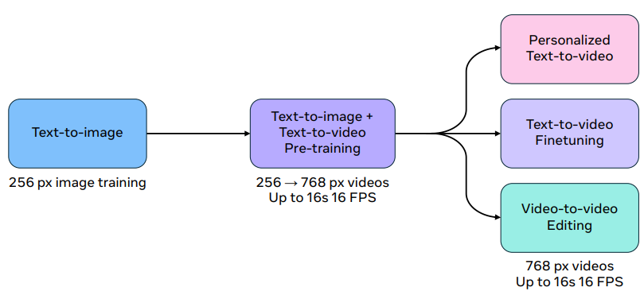

# MovieGen

Open reproduction of MovieGen by Meta (https://ai.meta.com/research/movie-gen/)

 Notes 

- Scaling training data and compute on vanilla transformer from [Attention is All you Need](https://arxiv.org/abs/1706.03762) works well for generative video.
- Flow matching objective.
  - [Flow Matching for Generative Modeling](https://arxiv.org/abs/2210.02747)
  - [An introduction to Flow Matching](https://mlg.eng.cam.ac.uk/blog/2024/01/20/flow-matching.html)
  - [Flow Matching in Latent Space](https://vinairesearch.github.io/LFM/)
  - [Match flows, not scores](https://ayandas.me/blogs/2024-04-26-flow-matching-strightning-sd3.html)
- Movie Gen Video is trained on ~100M videos and ~1B images
  - To improve video generation quality, SFT on small high quality video/text dataset
  - 30B parameters, can reason about object motion, subject-object interactions, geometry, camera motions, physics and more
  - Other capabilities include personalization, precise editing, etc.
- Movie Gen Audio is trained on ~1M hours of audio
  - SFT performed on small set of high quality (text, audio) and (text, audio, video) pairs.
- Training recipe:
  - Text-to-image pretraining at 256px.
  - Text-to-image + Text-to-video pretraining at 768px (upto 16s at 16 FPS).
  - Personalized text-to-video, finetuning, video-to-video editing at 768px

<table align="center">
<tr align="center"></tr>
</table>

- Joint foundational model for text-to-image and text-to-video tasks. Images are treated as single frame video. Image-text pairs are easier to scale with diverse concepts and styles, and so joint modeling leads to better generalization capabilities.
- Single temporal autoencoder (TAE) for RGB images and videos to map to latent space.
- Spatial upsampler upscales 768px to 1080p resolution.
- Text encoders used: [UL2](https://huggingface.co/google/ul2), [MetaCLIP](https://huggingface.co/facebook/metaclip-h14-fullcc2.5b), [ByT5](https://huggingface.co/google/byt5-large)
- TAE compresses video of shape $T' \times 3 \times H' \times W'$ to continuous-valued latent $T \times C \times H \times W$ where $T \lt T', H \lt H', W \lt W'$. 8x compression ratio.
  - **Architecture:**
    - Similar to image VAE but has extra temporal layers. After each 2D spatial convolution, 1D temporal convolution and 1D temporal attention after each 2D spatial attention. All temporal convolutions use symmetrical replicate padding.
    - Temporal downsampling performed with strided convolution with `stride=2`, and upsampling by neareast neighbour interpolation.
    - Increasing latent channels leads to better reconstruction. `C = 16` is chosen.
    - Spatial parameters are initialized from image VAE and then temporal parameters are inflated. Jointly trained on image-video data in ratio 1:3.
    - Improvements to training objective: Original objective in [High Resolution Image Synthesis with Latent Diffusion Models](https://arxiv.org/abs/2112.10752) leads to "spots" in pixel space - latent vectors with high norms in certain spatial locations. Loss penalty for encoding values far from the mean. Given an input latent $X$, outlier penalty loss (OPL) is described as:

      $\mathcal{L}_{\text{OPL}}(X, r) = \frac{1}{HW} \sum_{i=1}^{H} \sum_{j=1}^{W} \max \left( \| X_{i,j} - \text{Mean}(X) \| - r \| \text{Std}(X) \| , 0 \right)$
    
      $r$ is a scaling factor denoting how far outside the standard deviation a latent value needs to be for penalization to take effect. $\mathcal{L}_{\text{OPL}}$ is added to standard VAE losses (reconstruction, discriminator, perceptual). They set $r = 3$ and a large loss weight for outlier loss.
  - Temporal tiling: To support efficient inference, input video and latent tensors are broken into tiles along temporal dimension and alpha blended. Standard approach similar to spatial tiling. [Reference for spatial tiling](https://github.com/huggingface/diffusers/blob/99f608218caa069a2f16dcf9efab46959b15aec0/src/diffusers/models/autoencoders/autoencoder_kl_cogvideox.py#L1299). Tile size of 32 pixel-space frames, or 4 latent-space frames, tile without overlap in encoder, tile with overlap of 16-pixel space (2 latent-space) frames in decoder. Standard linear blending.
  - Flow matching objective. Video sample in latent space $X_1$ has noise added to it sampled from normal distribution, at timestep $t \in [0, 1]$. Model is trained to predict velocity - $V_t = \frac{dX_t}{dt}$, which teaches the model to "move" noisy sample in direction of clean latent sample.
    - Simple linear interpolation ([optimal transport path](https://arxiv.org/abs/2210.02747)): $X_t = t \cdot X_1 + (1 - (1 - \sigma_{min})t) \cdot X_0$, with $\sigma_{min} = 10^{-5}$.
    - Ground truth velocity: $V_T = \frac{dX_t}{dt} = X_1 + (\sigma_{min} - 1) \cdot X_0$.
    - Model predicts $V_t' = u(X_t, P, t; \theta)$, where $\theta$ denotes model parameters, $P$ is the prompt condition and $X_t$ is the noisy latent sampled at timestep $t$.
    - The model is trained by minimizing the mean squared loss between ground truth velocity and model prediction.
  - > Empirically, we found that Flow Matching was more robust to the exact choice of noise schedules and it outperforms diffusion losses (see Section 3.6.2). Thus, we adopt Flow Matching for its simplicity and high performance.

